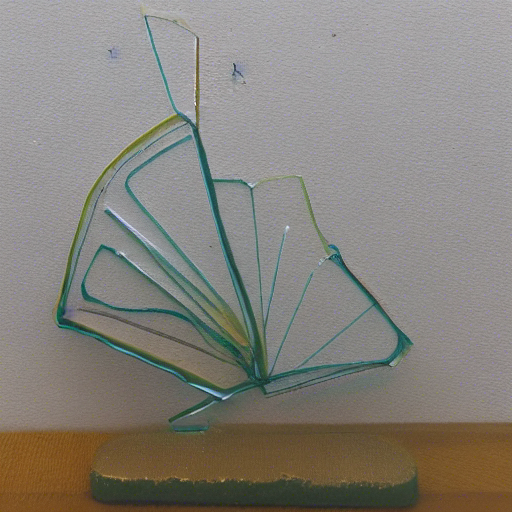
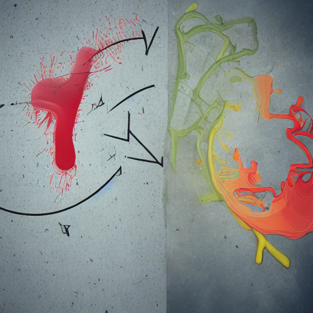
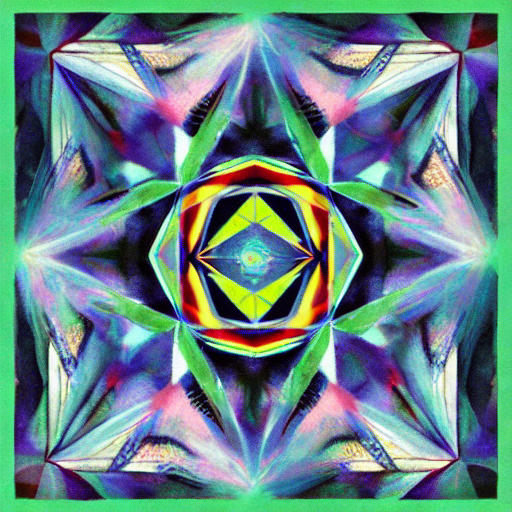
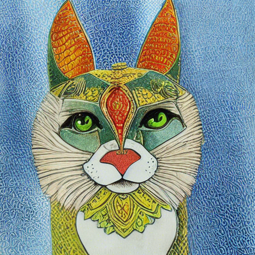

# Diffucinations
This is a series of explorations of making Stable Diffusion generate images with prompts drawn from weirder corners of the Unicode character set- symbols, mathematical expressions, and untranslatable alphabets, like Linear-A. The goal is to feed Stable Diffusion things it can't have good training data on, things that represent nonsense, and see what we can trick it into spitting out.

The results range from mysterious and creepy to obvious.

## Mathematical Terms
I started with a section of mathematical terms, things which have meaning but are unlikely to get much use in the training set, especially without any context.

### affine

This appears to be a glass sculpture inspired by a slime mold in a petri dish. There's a surreality to the way it floats.

### contrapositive

To me, this is a graffiti version of Kandinsky. It's got this lovely kinetics to it, but an organic nature to its presentation. Blended palettes- I could imagine this in an alley, or a bathroom.

## epsilon

I'm sure there's a very goon reason why "epsilon" generates this image, which evokes to me a small accent of stonework. The central hole makes me wonder if it's part of a fountain.

## ▲recursion△

This mixes a mathematical term with some unicode characters. The result is this delightful kaleidoscope image. It does hint a bit at having recursive structure.

## Ssendnik

Ssendnik, or "kindness" backwards. Apparently Stable Diffusion is biased to think that's a cat.

### Ssendnik

### Ssendnik Playing with a Toy

### Ssendnik Eats

## More to come
I'll update this with more of the unexpected or strange unicode strings. There's a lot of fun stuff, but this is a good starting point.