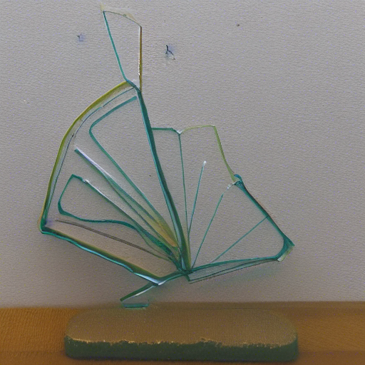
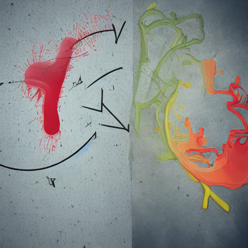
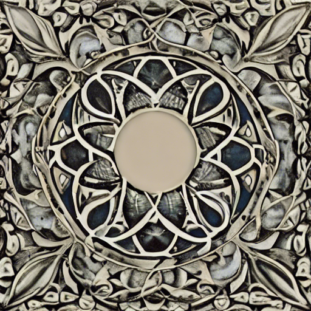
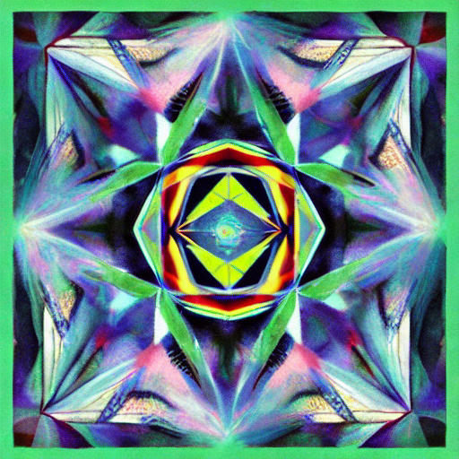
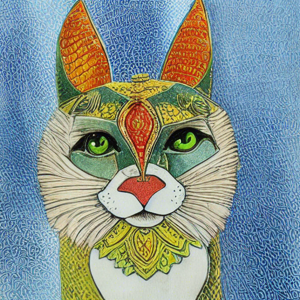
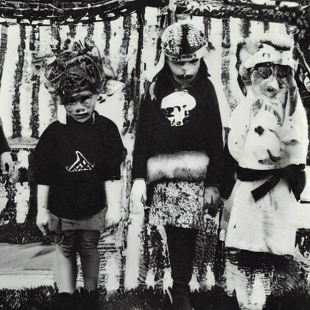
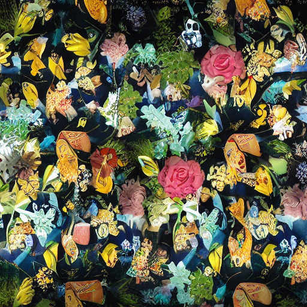

# Diffucinations
This is a series of explorations of making Stable Diffusion generate images with prompts drawn from weirder corners of the Unicode character set- symbols, mathematical expressions, and untranslatable alphabets, like Linear-A. The goal is to feed Stable Diffusion things it can't have good training data on, things that represent nonsense, and see what we can trick it into spitting out.

The results range from mysterious and creepy to obvious.

## Mathematical Terms
I started with a section of mathematical terms, things which have meaning but are unlikely to get much use in the training set, especially without any context.

### affine

This appears to be a glass sculpture inspired by a slime mold in a petri dish. There's a surreality to the way it floats.

### contrapositive

To me, this is a graffiti version of Kandinsky. It's got this lovely kinetics to it, but an organic nature to its presentation. Blended palettes- I could imagine this in an alley, or a bathroom.

## epsilon

I'm sure there's a very goon reason why "epsilon" generates this image, which evokes to me a small accent of stonework. The central hole makes me wonder if it's part of a fountain.

## ▲recursion△

This mixes a mathematical term with some unicode characters. The result is this delightful kaleidoscope image. It does hint a bit at having recursive structure.

## Ssendnik

Ssendnik, or "kindness" backwards. Apparently Stable Diffusion is biased to think that's a cat.

### Ssendnik

### Ssendnik Playing with a Toy

### Ssendnik Eats

## Alternative Alphabets
I'm going out on a limb, but I suspect most of Stable Diffusion's data is trained in English. But there are lots of other languages and alphabets. What happens when we use some of those? Even better, what happens when I'm just grabbing a handful of characters which spell out nonsense?

### Ʒ

Something about this feels cyberpunk and dystopian.

### Þ

A whirlpool in a forest? Moss around a sinkhole? I don't rightly know what this is.

### ʘ

And now we get into some odd creatures. A birdmouse with meat for a face?

### Θ

And Θ keeps favoring birds, for some reason. This is jewelry.

### Ξ

This is one of my favorites. An odd manuscript, with drawings that imply something mysterious for those that can understand it.

### ΞΨ

This hints at an album cover. It attempts to render some text, but not the text I fed it. Here I feel like we're getting into some real shapes of the trained network.

### Ϟ

A rather convincing ring, in macro.

### τ

The bird motif appears again, but now we have an alien language written out, in… enamel? Blood?

### Ϡ

A Japanese character gets us a Shinto-esque object, buried in the dirt. 

### ޓ

More bird motif, but this one drifts into Vaporwave collage.

### 〄

All the charm of an 1920s Halloween costume photo rendered as a Death Grips album cover. Horrifying and mystifying.

### ቹᑅ

This is a lovely floral pattern that I'd wear as a shirt.

### Ħ

A mysterious seaside city spills out of this prompt. It looks like ruins, which makes us wonder about who once lived there.

### ቹ

A well hidden cat-squirrel taking a nap in an awkward position.

### 𐘓𐛧𐛦

I opted to try some Linear-A, since what better way to prompt an AI than in an alphabet no one understands? Somehow, this managed to spit out something that has a vibe of an ancient carving or ancient jewelry.

## More to come
I'll update this with more of the unexpected or strange unicode strings. There's a lot of fun stuff, but this is a good starting point.